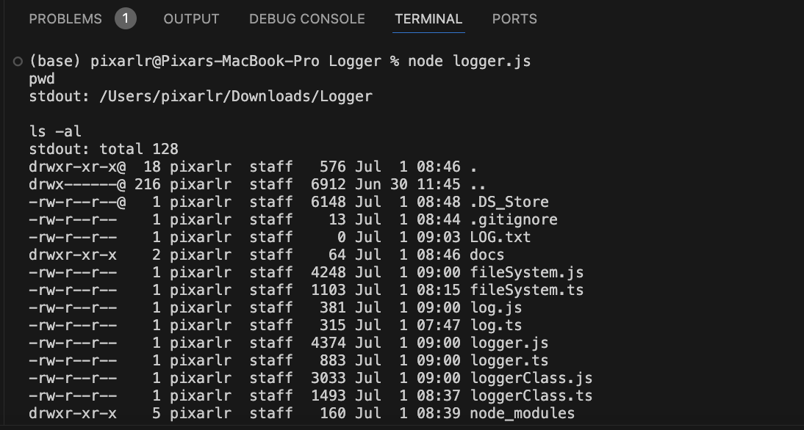
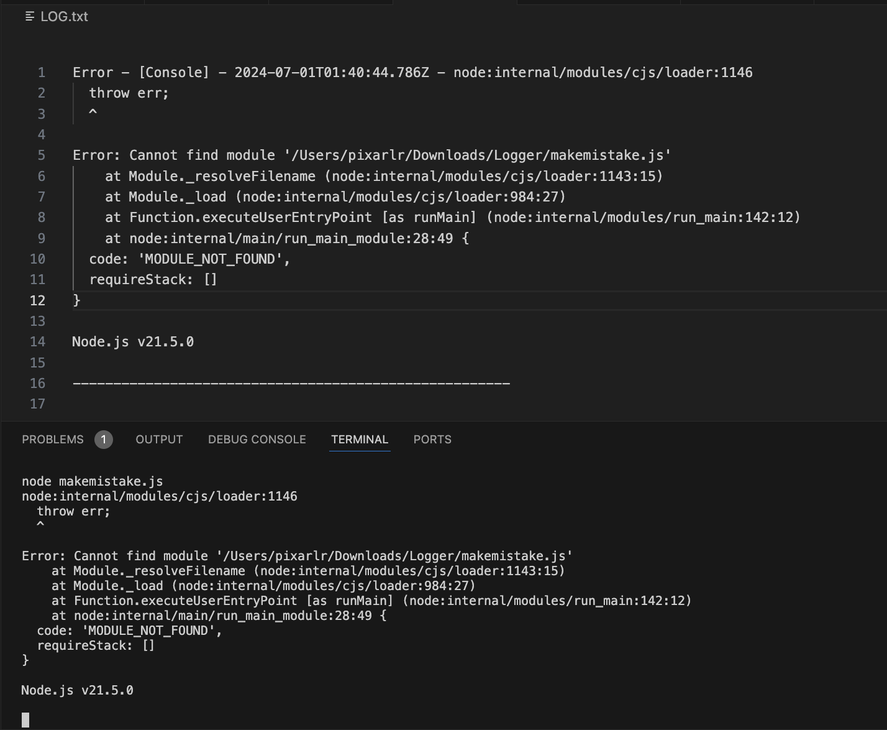
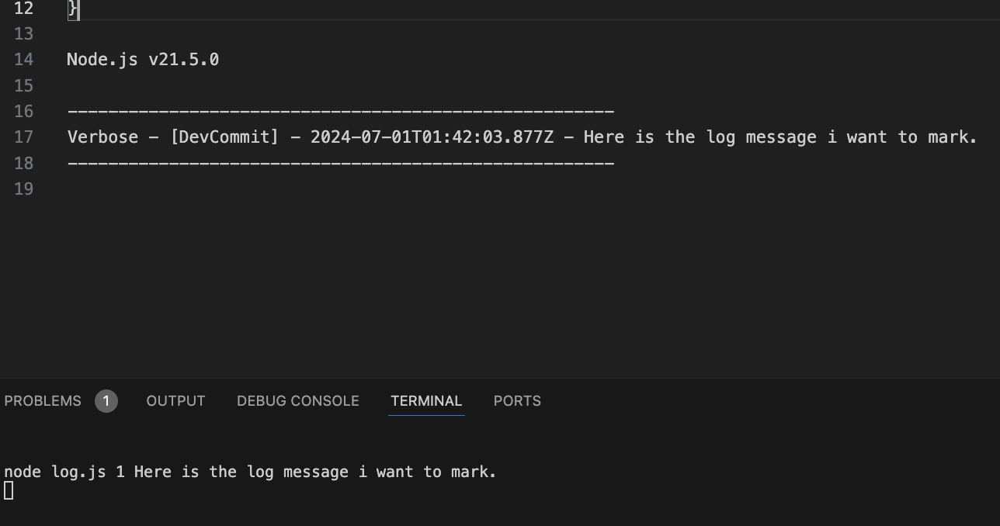

# 1. Compiling TypeScript Files
## Use the command 
> tsc fileSystem.ts log.ts logger.ts loggerClass.ts 
- To compile the 4 TypeScript files into JavaScript files.
# 2. Logging Message
## There are two ways to record log messages:
### 2.1 Automatic logging:
> Run the node logger.js 
- the script will listen to the terminal input and You may INSERT the terminal command like normal way. 

- automatically record the error messages to the LOG.txt file.

### 2.2 Manual logging:
- Run the sample 
> node log.js 1 Here is the log message i want to mark. 

- The command recods manually the log message to the LOG.txt file.
- Params[2] is a number type. Please refer to the log message levels. 
# 3 Log message levels:
> Verbose = 1
> Info = 2
> Warning = 3
> Error = 4

## Total time: 8.5hrs